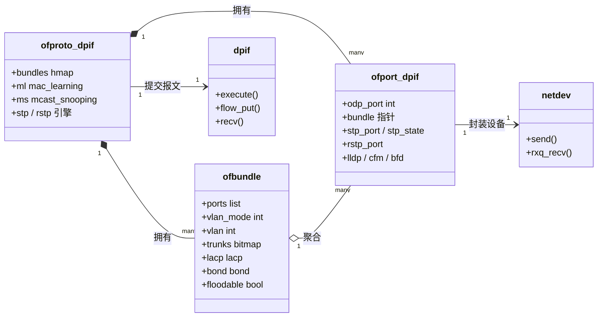
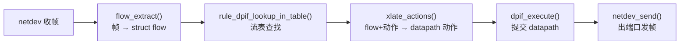
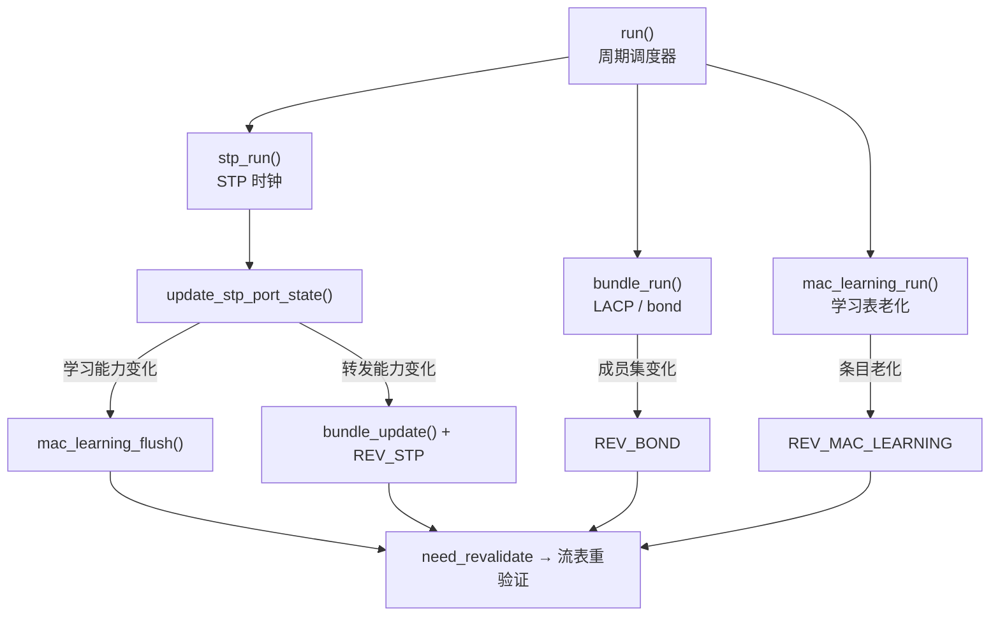

# VLAN / bridge / STP / LACP / LLDP

## 定位

本模块覆盖链路层（第 2 层）的控制与转发机制，处于协议主干「Ethernet / VLAN / bridge」一节
（`protocol-learning-design.md` §4.2）：

- **VLAN（IEEE 802.1Q）**：在单一物理广播域内切分逻辑隔离域（广播域与寻址域）。
- **bridge（IEEE 802.1D，透明桥）**：MAC 学习 + 按 MAC/VLAN 转发，替代简单的集线器式泛洪。
- **STP（IEEE 802.1D Spanning Tree Protocol）**：在存在环路的桥网络中去环，避免广播风暴。
- **LACP（IEEE 802.3AX / 802.1AX）**：把多条物理链路聚合为一个逻辑端口，同时提供冗余。
- **LLDP（IEEE 802.1AB）**：链路层邻居发现与能力通告，属管理平面而非数据平面。

本模块负责解决的核心问题：**在共享介质演进为交换式介质之后，如何在不重新设计编址的
前提下，提供隔离（VLAN）、连通（bridge）、无环（STP）、聚合（LACP）与可观测性（LLDP）**。

## 前置模块

按 `protocol-learning-design.md` §4 主干顺序，本模块的前置模块：

1. **Ethernet / 帧编码**：Ethernet II / 802.3 帧、MAC 地址、EtherType、最小/最大帧长。
2. **协议抽象与报文编码**（§4.1）：字节序、TLV、长度与边界、校验、超时与状态机分析语言。

本模块的后续模块（ARP/NDP、IP、路由等）依赖此处建立的「二层的隔离域与转发域」概念。

## 推荐阅读顺序

1. 先读 `protocol.md`，建立问题定义、抽象对象、wire format 与核心机制的整体图景。
2. 再读 `state-machine.md`，理解 STP 的显式状态机与 bridge 的 MAC 学习流程。
3. 进入 `src/README.md`，按「转发闭环 → 控制闭环」两条链组织源码阅读：
   - 转发闭环（data plane）：`netdev.c`（收包）→ `dpif.c`（datapath 抽象）→ `ofproto-dpif.c`（flow lookup / action）→ 出端口。
   - 控制闭环（control plane）：`ofproto-dpif.c` 的 `run()` 入口 → STP/LACP/LLDP 周期驱动。
4. 最后用 `references.md` 对照规范原文与 Linux bridge 实现，比较设计取舍。

## 源码入口

上游源码导航见 `src/README.md`。快速入口：

- `src/upstream/ofproto/ofproto-dpif.c:1864` 的 `run()`：所有周期控制（STP、RSTP、LACP、MAC 学习）的统一驱动入口。
- `src/upstream/ofproto/ofproto-dpif.c:4244` 的 `ofproto_dpif_execute_actions()`：转发动作执行（flow lookup 后落地动作）。
- `src/upstream/lib/dpif.c`：`dpif_recv()` / `dpif_send()` / `dpif_flow_*()` 为 datapath 抽象。
- `src/upstream/lib/netdev.c`：`netdev_send()` 与端口抽象。
- `src/upstream/lib/flow.c:349` 的 `parse_vlan()`：802.1Q 标签解析。

## 代码结构

### 对象模型

OVS 不用「单个端口」当转发单位，而用 **bundle**：一个 bundle 可以只含一个端口，也可以是
LACP/bond 聚合组。VLAN 配置、`floodable`、LACP 挂在 bundle 上；STP 状态挂在 ofport 上，
再反馈给 bundle（非 Forwarding → 整组不可泛洪）。



关系记号：`*--` 组合（生命周期随拥有者）、`o--` 聚合、`-->` 依赖。

### 两条闭环

数据面（收一帧 → 发出去）：`flow.c` 解析 → `ofproto-dpif.c` 查表/翻译 → `dpif.c` 落地 → `netdev.c` 出端口。



控制面：`run()` 本身无状态，只是调度器；各子状态机变化后统一改 `need_revalidate`、
冲刷学习表、更新 STP 状态与 `floodable`。



### 三层映射

协议概念到源码对象要经过三次映射，读源码时按「改哪个字段、置哪个 revalidate」看即可：

| 协议概念 | 实现载体 |
| --- | --- |
| 端口 | `ofport_dpif`（STP 状态），聚合/转发判定看 `ofbundle` |
| 隔离域 | bundle 上的 `vlan` / `trunks`（`vlan-bitmap.c`） |
| 去环 | `ofport_dpif.stp_state`（结果）；状态机在未复制的 `stp.c` |

## 主实现 / 对照实现

按 `protocol-learning-design.md` §4.0 选型：

| 角色 | 实现 |
| --- | --- |
| 主实现 | **Open vSwitch**（仓库 `github.com/openvswitch/ovs`，固定 tag `v2.17.0`） |
| 对照实现 | Linux `bridge` / `vlan` / `bonding` 工具与内核实现（仅作比较，不作为主源码） |

## 目录规范

参见根目录 `protocol-learning-design.md` §3。本目录结构：

```text
vlan-bridge/
├── README.md            # 本文件：定位、前置、阅读顺序、源码入口
├── protocol.md          # 问题定义、抽象对象、wire format、核心机制、不变量、边界
├── state-machine.md     # STP 状态机、MAC 学习流程
├── references.md        # 规范、上游仓库、其他实现
└── src/
    ├── LICENSES/LICENSE # 上游许可证（Apache-2.0）
    ├── upstream/        # 上游源码（见 src/README.md 清单）
    └── README.md        # 文件清单、阅读顺序、调用链、裁剪说明
```